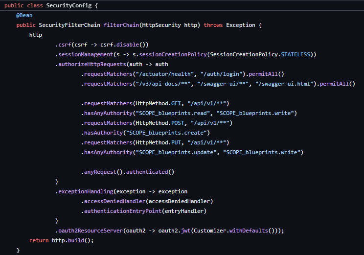
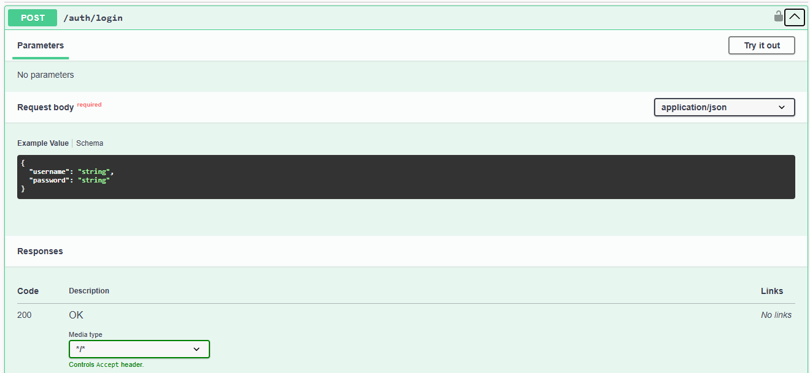
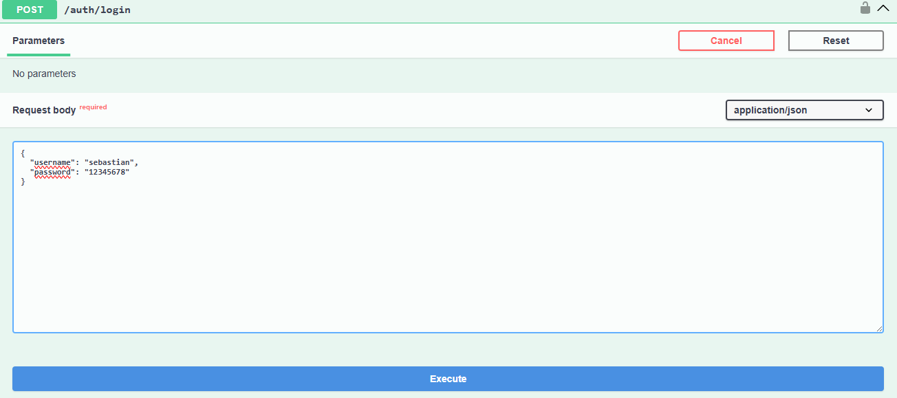
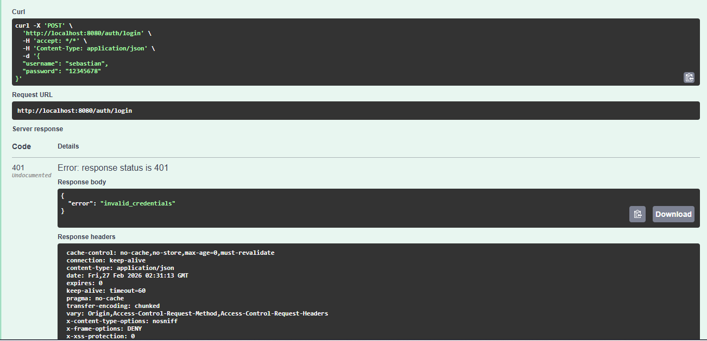
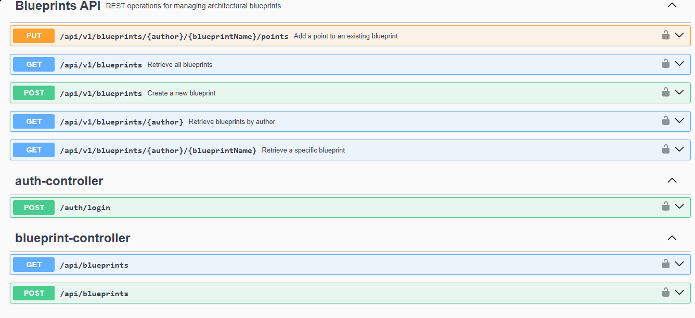
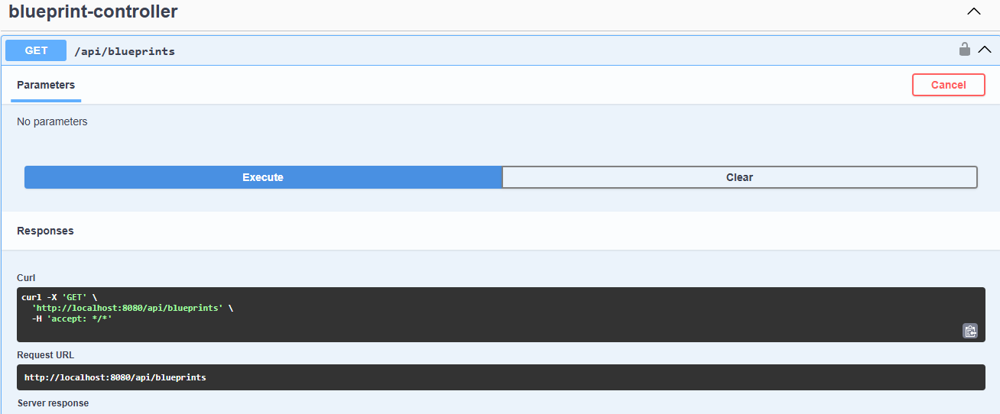
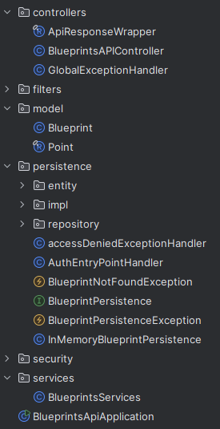
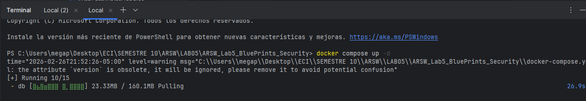
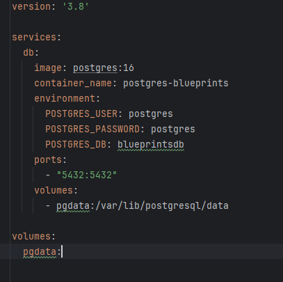
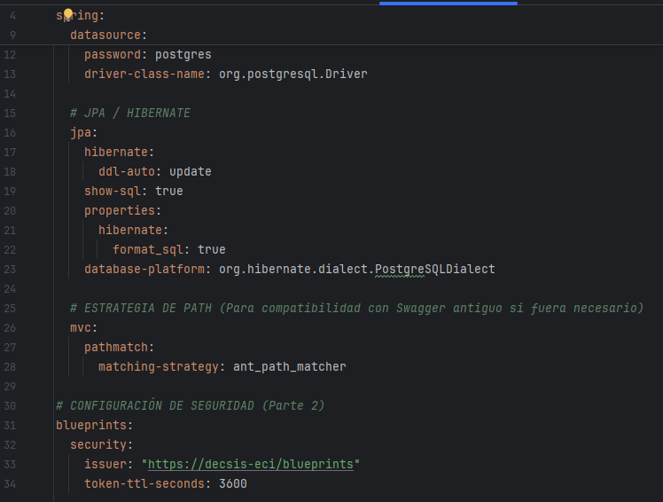

# Laboratorio 5 - Blueprints Security

**Elaborado por**

Sebastián Villarraga

Juan Carlos Leal Cruz

## **Parte 1. Revisión de la Configuración de Seguridad**
En el `SecurityConfig`, el enrutamiento y la protección de los endpoints se manejan completamente dentro del método `filterChain`.

Spring Security utiliza el objeto `HttpSecurity` para crear una cadena de filtros que intercepta todas las peticiones HTTP entrantes. El método específico que se usa para definir las reglas de acceso es `.authorizeHttpRequests()`. Dentro de este método, las peticiones se evalúan de arriba hacia abajo usando `.requestMatchers()`, lo que significa que la primera regla que coincida con la ruta URL de la petición es la que se aplica.

### **1. Endopoint Públicos**
Los endpoints públicos son aquellos a los que cualquier persona puede acceder sin necesidad de un token o autenticación. Se definen utilizando el método `.permitAll()`.
- Salud y Login: "/actuator/health": Se usa para verificar si la aplicación está en ejecución.
  - `/auth/login`: El endpoint donde los usuarios enviarán sus credenciales para recibir un token JWT.
  - Regla: `.requestMatchers("/actuator/health", "/auth/login").permitAll()`

- Documentación de la API (Swagger): "/v3/api-docs/", "/swagger-ui/", "/swagger-ui.html". Estas rutas exponen la interfaz gráfica y los datos de la documentación de tu API.
  - Regla: `.requestMatchers("/v3/api-docs/", "/swagger-ui/", "/swagger-ui.html").permitAll()`

En la siguiente imagen se puede ver el endpoint en la documentación de la API.

Swagger UI cargando sin necesidad de token



### **4. Endpoints Protegidos**
Los endpoints protegidos requieren que el usuario envíe un token JWT válido en las cabeceras (headers) de su petición HTTP. Tu configuración define dos niveles de protección:
- Protección de la API por Scope
  - Cualquier endpoint que comience con "/api/" (por ejemplo, `/api/blueprints`) está fuertemente protegido. No solo se requiere que el usuario esté autenticado, sino que su token JWT también debe contener permisos específicos (llamados `scopes`).
  - Regla: `.requestMatchers("/api/**").hasAnyAuthority("SCOPE_blueprints.read", "SCOPE_blueprints.write")`
  
  Para acceder a cualquier parte de la API, el token debe tener forzosamente el scope blueprints.read o el scope blueprints.write.

Los endpoints que inician con "/api/" son los explicados anteriormente

Intentar hacer GET a /api/blueprints sin auntenticacion

- Protección General (Regla de captura):
  De igual forma se tiene definida una regla para las URLs que no están definidas de forma explícita.
  - Regla: `.anyRequest().authenticated()`
  
  Esto lo que hace es que si un usuario intenta acceder a cualquier otro endpoint de la aplicación, debe al menos haber iniciado sesión (estar autenticado con un JWT válido), incluso si la ruta no requiere un scope específico.

---

## **Parte 2. Implementación de seguridad**
### **1. Inclusión parte 1 BluePrints**
Se añade a este laboratorio las clases del laboratorio 4, es decir, se le añade persistencia usando el mismo método que se usó en la parte 1. Para ello se copiaron las carpetas y archivos dentro de este nuevo repo, de tal forma que la protección de Endpoints se va a realizar sobre la persistencia creada para la parte 1 del lab.
#### **❗️ IMPORTANTE. Ejecución**

En la imagen veremos la estructura base del proyecto con la persistecia aladida


Para la correcta ejecución de este lab es preciso ejectuar el siguiente comando:
```bash
docker compose up -d
```


De esta forma, se usa el archivo `docker-compose.yml`para levantar el contenedor de Docker que nos ayudara a persistir los datos en una PostgreSQL, tal como se explica en [Lab4_ARSW_BluePrint_Part1](https://github.com/Sebastian-villarraga/LAB04_ARSW_26)

Archivo docjer-composter.yml


### **2. Inclusión de seguridad**
En esta sección se detalla la arquitectura de seguridad implementada mediante **Spring Security**, actuando como un **OAuth2 Resource Server** que valida tokens **JWT** (JSON Web Tokens) para proteger los recursos de la API de Blueprints.
...

Configuración del Servidor

La aplicación se ejecuta en el puerto 8080.

🔹 Base de Datos

Se conecta a una base de datos PostgreSQL local llamada blueprintsdb.

Usuario y contraseña: postgres.

Se utiliza el driver oficial de PostgreSQL.

🔹 JPA / Hibernate

ddl-auto: update permite que Hibernate actualice automáticamente el esquema de la base de datos.

show-sql: true y format_sql: true permiten visualizar en consola las consultas SQL generadas.

Se especifica el dialecto de PostgreSQL para correcta compatibilidad.

🔹 Compatibilidad MVC

Se define ant_path_matcher como estrategia de coincidencia de rutas, útil para compatibilidad con Swagger.

🔹 Configuración de Seguridad

Se define un issuer para los tokens JWT:
https://decsis-eci/blueprints

El tiempo de expiración del token es de 3600 segundos (1 hora).



| Endpoint          | Método     | Requiere Scope     |
| ----------------- | ---------- | ------------------ |
| `/api/blueprints` | GET        | blueprints.read    |
| `/api/blueprints` | POST       | blueprints.write   |
| `/api/**`         | Cualquiera | read o write       |
| Otros endpoints   | -          | Solo autenticación |


# CONFIGURACIÓN DE BASE DE DATOS (Parte 1)
datasource:
url: jdbc:postgresql://localhost:5432/blueprintsdb
username: postgres
password: postgres
driver-class-name: org.postgresql.Driver

# JPA / HIBERNATE
jpa:
hibernate:
ddl-auto: update
show-sql: true
properties:
hibernate:
format_sql: true
database-platform: org.hibernate.dialect.PostgreSQLDialect

# ESTRATEGIA DE PATH (Para compatibilidad con Swagger antiguo si fuera necesario)
mvc:
pathmatch:
matching-strategy: ant_path_matcher

# CONFIGURACIÓN DE SEGURIDAD (Parte 2)
blueprints:
security:
issuer: "https://decsis-eci/blueprints"
token-ttl-seconds: 3600
#### **Configuración de Permisos.**
La API implementa control de acceso basado en JWT y scopes, utilizando Spring Security como Resource Server.

Los permisos están definidos de la siguiente manera:

🔹 Endpoints Públicos

/actuator/health
/auth/login
/swagger-ui/**
/v3/api-docs/**
No requieren autenticación.

🔹 Endpoints Protegidos /api/v1/**
Método HTTP	Scope Requerido	Descripción
GET	blueprints.read o blueprints.write	Consultar blueprints
POST	blueprints.create	Crear nuevos blueprints
PUT	blueprints.update o blueprints.write	Actualizar blueprints

Spring convierte automáticamente los scopes del JWT en autoridades con el prefijo SCOPE_.

Ejemplo:

blueprints.read → SCOPE_blueprints.read

### **3. Manejo de Excepciones de Seguridad**
La aplicación implementa manejo personalizado de errores de seguridad mediante:
AuthEntryPointHandler → Maneja errores de autenticación
accessDeniedExceptionHandler → Maneja errores de autorización

